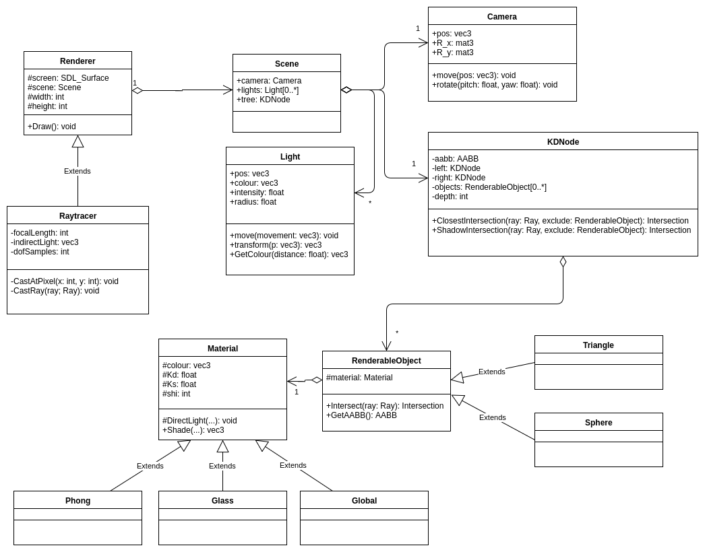
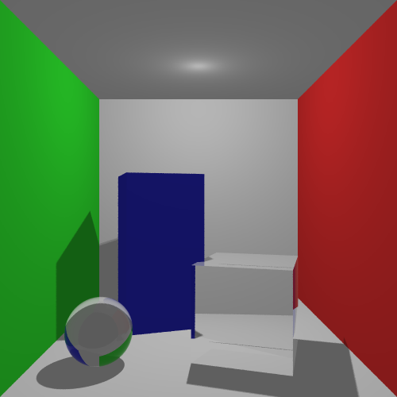
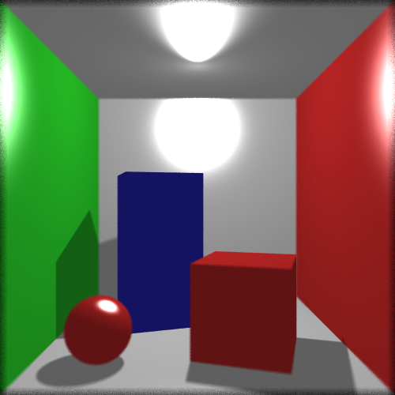

# Ray Tracer

## Design
The ray tracer has been designed with extensibility in mind from the beginning. We have made good use of the object oriented features in C++ to implement various aspects of the system. The Raytracer class derives from the Renderer class, which contains various information about the screen which is to be rendered to. The Renderer also contains a Scene object, which holds the lights, the objects in the scene and the camera. Originally we envisioned having the Rasteriser and Raytracer deriving from the same Renderer class, but we found this was more trouble than it was worth.  

Objects derive from the RenderableObject class which allows us to easily create more primitive objects if we want to (we have only added a sphere on top of the original triangle). 

We also have a Material base class which has been extended to create lots of different types of material, such as the Phong material and the Glass material. Each of these implements a Shade method which is called when we want to determine the colour of the point that a light ray intersects with. Each object has a pointer to one of these materials.

Here is a simplified UML diagram showing the core classes in the ray tracer.

## Features
Here is a list of the most important features that we have implemented.

* Soft shadows
* Depth of field
* Multiple light sources
* Anti-aliasing
* Phong lighting
* Object importer
* Global illumination (Monte-Carlo)
* Mirrors
* Glass (Refraction)

Below you can see the glass material which uses fresnel equations to vary the amount of reflected and refracted light based on the angle of indidence.

The image below shows the ray tracer using the Phong lighting model. We have also turned on the depth of field effect. You can also see in this image and the one above that we have soft shadows.

## Optimisations
### M&ouml;ller-Trumbore Intersection
In order to improve the speed of our raytracer we improved the intersection calculation code to use the M&ouml;ller-Trumbore algorithm. This algorithm is faster than the original method that required a matrix inversion. The M&ouml;ller-Trumbore algorithm rejects non-intersecting rays early, thus reducing computation. 

### K-D Tree
We implemented our own K-D Tree which automatically partitions the scene. The tree then has its own intersection function which is used when we want to calculate whether a ray intersects with an object. This function will only look in partitions of the tree that the ray intersects with, therefore cutting out many intersection tests with triangles in other parts of the scene. This is advantagous when we import a model with thousands of triangles.

### OpenMP
We have added a few OpenMP compiler directives to speed up some of the raycasting sections of the code.
